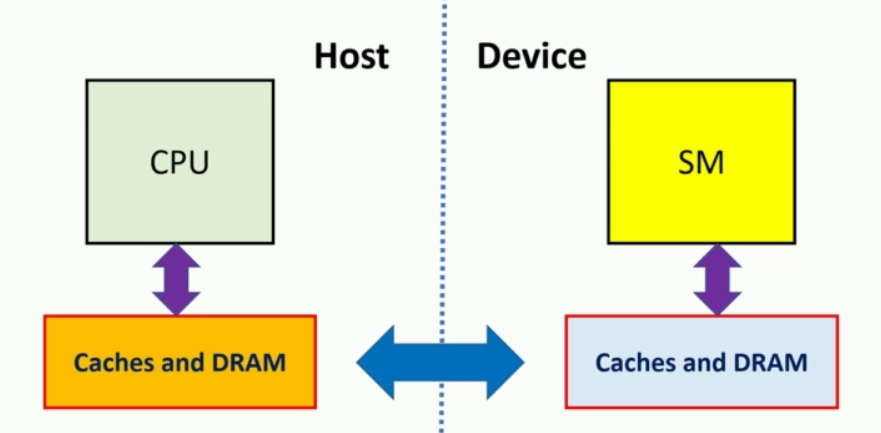

- In CUDA we work with two devices on the host and the device, so we have host memory and the device memory.
- GPU has its own memory hierarchy which is physically located in the GPU.
- So this is a perfect time to loop back to our discussion on what a generic CUDA program is like. We initialize the data then we have device execution and the host logic. we wait for the GPU to provide us the result.



- We can transfer the contents of the host and device using the below function.
```cpp
cudaMemCpy(destination ptr, sourse ptr, size in byte, direction)
```

- The *direction* can be one of the below:

| Direction | Keyword |
| ---- | ---- |
| Host to Device| #cudamemcpyhtod|
| Device to Host| #cudamemcpydtoh|
|Device to Device| #cudamemcpydtod|

Let us understand memory transfer with a simple example.

**Example1:** Let us transfer the elements from host to device and print the elements in the device.

```cpp
#include "cudaruntime.h"
#include "device_launch_parameters.h"

#include <stdio.h>
#include <stdlib.h>
#include <cstring.h>
#include <time.h>

__global__ void mem_trs_test(int * input){
	int gid = blockIdx.x * blockDim.x + threadIdx.x;
	printf("tid: %d, gid : %d, value : %d \n", threadIdx.x,gid,input[gid])	
}

int main(){
	int size = 128;
	int byte_size = size * sizeof(int);
	int * h_input;
	h_input = (int*)malloc(byte_size);

	time_t t;
	srand((unsigned)time(&t));
	for(int i = 0; i < size; i++){
		h_input[i] = (int)(rand() & 0xff);
	}

	int *d_input;
	cudaMalloc((void**)&d_inpout, byte_size);

	cudaMemcpu(d_inpout, h_input,byte_size,cudaMemcpyHostToDevice);

	dim3 block(64);
	dim3 grid(2);

	mem_trs_test <<<grid, block>>>(d_input);
	cudaDeviceSynchronize();

	//reclaiming the memory
	cudaFree(d_input);
	free(h_input);

	
	cudaDeviceReset();
	return 0;
}

```

- To perform Memory operation in the device CUDA API provides set of functions which has similar name as C counter parts.

| C | CUDA |Description|
|---|---|---|
| #malloc| #cudaMalloc|Allocates the memory in the host and device|
| #memset| #cudaMemset| memset() sets values for given memory location and we have cudaMemset() function which performs same operation in the device|
| #free| #cudaFree| free() function reclaims specified memory location in the host and cudaFree() reclaims in the device|

- Usually for performance reasons we keep the #blocksize as multiples of 32. 

