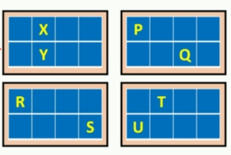

# ThreadIdx

- CUDA runtime uniquely initialised #threadIdx variable for each thread depending on where that particular thread is located in the thread block.
- *threadIdx* is a #dim3 type variable

**Example-1:** consider a 1-D grid with 1 thread block with 8 threads


| Thread Name | ThreadIdx.X | ThreadIdx.Y| ThreadIdx.Z|
| --- | --- | --- | --- |
| **A** |0|0|0|
| **B** |1|0|0|
| **C** |2|0|0|
| **D** |3|0|0|
| **E** |4|0|0|
| **F** |5|0|0|
| **G** |6|0|0|
| **H** |7|0|0|

**Example-2:** consider a 1-D grid with 2 thread block with 8 threads


| Thread Name | ThreadIdx.X | ThreadIdx.Y| ThreadIdx.Z|
| --- | --- | --- | --- |
| **A** |0|0|0|
| **B** |1|0|0|
| **C** |2|0|0|
| **D** |3|0|0|
| **E** |0|0|0|
| **F** |1|0|0|
| **G** |2|0|0|
| **H** |3|0|0|

**Example-3:** consider a 1-D grid with 4 thread block with 4 threads per block as shown below.


| Thread Name | ThreadIdx.X | ThreadIdx.Y| ThreadIdx.Z|
| --- | --- | --- | --- |
| **P** |0|0|0|
| **Q** |2|0|0|
| **R** |1|0|0|
| **S** |3|0|0|
| **T** |0|0|0|
| **U** |2|0|0|
| **V** |0|0|0|
| **X** |3|0|0|

**Example-4:** consider a 1-D grid with 4 thread block with 8 threads per block as shown below.



| Thread Name | ThreadIdx.X | ThreadIdx.Y| ThreadIdx.Z|
| --- | --- | --- | --- |
| **P** |0|0|0|
| **Q** |2|1|0|
| **R** |0|0|0|
| **S** |3|1|0|
| **T** |1|0|0|
| **U** |0|1|0|
| **X** |1|0|0|
| **Y** |1|1|0|


## Example Exercise#

**Example-5:** Lets code a CUDA program that is going to launch a 2-D grid which has 256 threads arranged into 2 thread blocks in x-dimension and y-dimension. So we will have 16 threads per block with 8 thread in x and y-dimension. 

```cpp
#include "cuda_runtime.h"
#include "device_launch_parameters.h"


#include <stdio.h>

//Device Code
__global__ void print_thread() {
    printf("x: %d  y: %d  z: %d \n", threadIdx.x, threadIdx.y, threadIdx.z);
}

//Host code
int main() {

    int nx, ny;

    nx = 16;
    ny = 16;

    //kernel launch parameters

    dim3 block(8, 8);
    dim3 grid(nx/block.x, ny/block.y);

    print_thread << <grid, block >> > (); // async call
    printf("Hello from CPU \n");
    cudaDeviceSynchronize();// will make the prgram stall till all the launched kernels have finished execution


    cudaDeviceReset();
    return 0;
}
```
