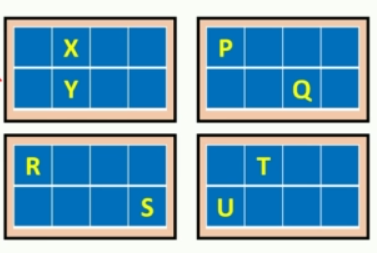

## BlockIdx
- In this page we will understand the use of blockIdx variable.
- CUDA runtime uniquely initialized blockIdx variable for each thread depending on the coordinates of the belonging thread block in the grid.
- blockIdx is a #dim3 type variable

**Example-1:** Consider a 1-D grid with 8 threads and 2 blocks 


| Thread Name | blockIdx.X | blockIdx.Y| blockIdx.Z|
| --- | --- | --- | --- |
| **A** |0|0|0|
| **B** |0|0|0|
| **C** |0|0|0|
| **D** |0|0|0|
| **E** |1|0|0|
| **F** |1|0|0|
| **G** |1|0|0|
| **H** |1|0|0|

**Example-2:** consider a 1-D grid with 4 thread block with 4 threads per block as shown below.


| Thread Name | blockIdx.X | blockIdx.Y| blockIdx.Z|
| --- | --- | --- | --- |
| **P** |0|0|0|
| **Q** |0|0|0|
| **R** |1|0|0|
| **S** |1|0|0|
| **T** |0|1|0|
| **U** |0|1|0|
| **V** |1|1|0|
| **X** |1|1|0|

**Example-3:** consider a 1-D grid with 4 thread block with 8 threads per block as shown below.



| Thread Name | blockIdx.X | blockIdx.Y| blockIdx.Z|
| --- | --- | --- | --- |
| **P** |1|0|0|
| **Q** |1|0|0|
| **R** |0|1|0|
| **S** |0|1|0|
| **T** |1|1|0|
| **U** |1|1|0|
| **X** |0|0|0|
| **Y** |0|0|0|

## blockDim

- The #blockDim variable consist number of threads in each dimension of a thread block. Notice all the thread block in a grid have same block size, so this variable value is same for all the threads in a grid.
- #blockDim is a #dim3 type variable.

**Example:** Consider the diagram below


- The blockDim.x is going to be 4 and the blockDim.y is going to be 2.
## gridDim

- The #gridDim variable consists number of thread blocks in each dimension of a grid.
- #gridDim is a #dim type variable.

**Example:** Consider the diagram below


- The gridDim.x is going to be 3 and the gridDim.y is going to be 2.

## Example Exercise

**Exercise-1:** The goal of this exercise is to use the the same example in the [[Organization of thread in a CUDA program Part-1#Example Exercise|previous page]] but use the #blockIdx, #blockDim and the #gridDim and observe the output.

```cpp
#include "cuda_runtime.h"
#include "device_launch_parameters.h"


#include <stdio.h>

//Device Code
__global__ void print_details() {
    printf("blockIdx x: % d  y : % d  z : % d \nblockDim x: % d  y : % d  z : % d\ngridDim x: % d  y : % d  z : % d ", blockIdx.x, blockIdx.y, blockIdx.z, blockDim.x, blockDim.y, blockDim.z,gridDim.x, gridDim.y, gridDim.z);
}

//Host code
int main() {

    int nx, ny;

    nx = 16;
    ny = 16;

    //kernel launch parameters

    dim3 block(8, 8);
    dim3 grid(nx/block.x, ny/block.y);

    print_details << <grid, block >> > (); // async call
    printf("Hello from CPU \n");
    cudaDeviceSynchronize();// will make the prgram stall till all the launched kernels have finished execution


    cudaDeviceReset();
    return 0;
}
```

**Exercise-2:** lets us try printing value of #threadIdx, #blockIdx, #gridDim variables for 3-D grid which has 4 threads in all X, Y and Z dimension.

