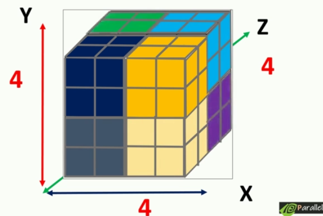

### Understanding the basic elements of CUDA program:

Almost every #CUDA  program follows the basic set of steps
- Initialization of data form CPU
- Transfer data form CPU context to GPU context
- Kernel launch with needed grid/block size
- Transfer  results back to CPU context from GPU context
- Reclaim the memory from both CPU and GPU

A #CUDA application might do this steps multiple times


### Elements of the CUDA program

- Host Code(Main function) - Runs the code in the CPU
- Device Code - Runs the code in GPU

The host code is responsible for the sequential part of the program and calling the #Device_code with proper device configurations.

### Getting started with our first CUDA code

```cpp
#include "cuda_runtime.h"
#include "device_launch_parameters.h"
#include <stdio.h>

//Device Code
__global__ void hello_cuda(){
	printf("Hello from CUDA world \n");
}

//Host code
int main(){ 
	//kernel launch parameters
	hello_cuda<< <1,10>> > (); // async call
	printf("Hello from CPU \n");
	cudaDeviceSynchronize();// will make the prgram stall till all the launched kernels have finished execution
	cudaDeviceReset();
	return 0;
}
```

## Understanding grid and block



### Grid

Grid is the collection of all the threads launch for a kernel, in the above code we had 20 threads. A three dimensional view of the grid can be visualised using the Cartesian coordinate system. 
- Each of the small cube can be visualised as a single thread.
- There will be some threads in the X, Y and Z dimension here we have 4 threads in each dimension, i.e we have 64 threads.
### Block
Threads in a grid is organised in to groups called thread blocks, these thread blokes allows the CUDA toolkit to synchronise and manage workload without heavy performance penalties.
- Thread block in a grid is a subset of a grid, hence we can also arrange it in Coordinate axis.
-  Example: if our 64 thread grid is arranged into 8 thread blocks, each having two threads in all three dimension.


> Kernel launch parameters tells the compiler on how much blocks exist and the number of threads per block.

```cpp
Kernel_name<<< number_of_blocks, 
				thread_per_block >>> (arguments)
```

The kernel launch takes four parameters but for now we will go ahead with two, now like how we did previously if we use integer we can specify only one dimension only. we use #dim3
data type to declare a three dimensional variable.

```cpp
dim3 variable_name(X, Y, Z);
```

dim3 is a vector type which in 1 by default, to access the individual values use the below.

```cpp
variable_name.x
variable_name.y
variable_name.z
```

**Example:** Lets say we need to launch the hello_world kernel with one dimensional grid with 32 thread arranged into 8 thread blocks, where each block having 4 threads in x dimension arrangement of the grid would look like this. This can be represented as:

```cpp
dim3 block(4,1,1);
```

This would be our second kernel launch parameter. First parameter is the number of blocks in each dimension.

```cpp
dim3 grid(8,1,1)
```

so we can launch our kernel using:
```cpp
dim3 block(4,1,1);
dim3 grid(8,1,1);

kernel_name<<<grid, block>>>();
```


**Example 2**: Now try creating the following shown below. A 2D grid, with total of 64 threads arranged in 16 threads in x dimension and 4 threads in y dimension. Each thread block will have 8 threads in x dimension and 2 thread in y dimension.

[example_2.png](./img/example_2.png)

```cpp
#include "cuda_runtime.h"
#include "device_launch_parameters.h"
#include <stdio.h>

//Device Code
__global__ void hello_cuda(){
	printf("Hello from CUDA world \n");
}

//Host code
int main(){ 
	//kernel launch parameters
	dim3 block(8,2,1);
	dim3 grid(2,2,1);

	hello_cuda<<<grid, block>>>();
	cudaDeviceSynchronize();// will make the prgram stall till all the launched kernels have finished execution
	cudaDeviceReset();
	return 0;
}

```

The same can also be implemented as:

```cpp
#include "cuda_runtime.h"
#include "device_launch_parameters.h"
#include <stdio.h>

//Device Code
__global__ void hello_cuda(){
	printf("Hello from CUDA world \n");
}

//Host code
int main(){ 
	//kernel launch parameters
  int nx, ny;
  nx = 16;
  ny = 4;
  
	dim3 block(8,2,1);
	dim3 grid(nx /block.x, ny/block.y);

	hello_cuda<<<grid, block>>>();
	cudaDeviceSynchronize();// will make the prgram stall till all the launched kernels have finished execution
	cudaDeviceReset();
	return 0;
}
```


# Limitations:

#limitation_for_block_size is that we can maximum have 1024 for X and Y direction and 64 for the Z direction.

```cpp
X* Y* Z <= 1024
```

The limitation for the number of thread blocks in each dimension is that you can maximum have 2^32 - 1 in x direction, 65536 threads in other dimension.  

> On not adhering to the above there will be kernel launch failures.
